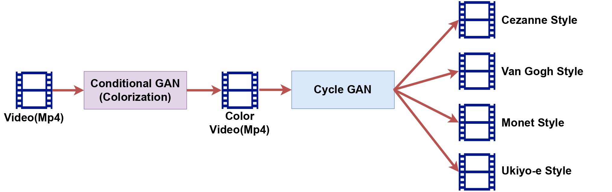

 

<br><br><br>

# Video colorization and translation using pix2pix and CycleGAN





## Prerequisites
- Linux 
- Python 3
- CPU or NVIDIA GPU + CUDA CuDNN

## Getting Started
### Installation

- Clone this repo:
```bash
git clone https://github.com/Terry01001/Video_colorization_translation.git
cd Video_colorization_translation
```

- Environmental Setup
  - For pip users, please type the command `pip install -r requirements.txt`.
  - For Conda users, you can create a new Conda environment using `conda env create -f environment.yml`.

### Train colorization model
- You can train a colorization model with the following script:
```bash
bash ./scripts/train_colorization.sh
```
After training, the model is saved at `./checkpoints/color_pix2pix/latest_net_G.pth`.


### Apply a pre-trained model (CycleGAN)
- You can download style_transfer pretrained models with the following instructions:
```bash
bash ./scripts/download_cyclegan_model.sh style_monet
bash ./scripts/download_cyclegan_model.sh style_cezanne
bash ./scripts/download_cyclegan_model.sh style_ukiyoe
bash ./scripts/download_cyclegan_model.sh style_vangogh
```
- The pretrained model is saved at `./checkpoints/{name}_pretrained/latest_net_G.pth`. Check [here](https://github.com/junyanz/pytorch-CycleGAN-and-pix2pix/blob/master/scripts/download_cyclegan_model.sh#L3) for all the available CycleGAN models.


- Then generate the results using
```bash
bash ./scripts/test_video_colorization_translation.sh
```

## Acknowledgments
This project is based on [pytorch-CycleGAN-and-pix2pix)](https://github.com/junyanz/pytorch-CycleGAN-and-pix2pix), thanks to their hard work.

